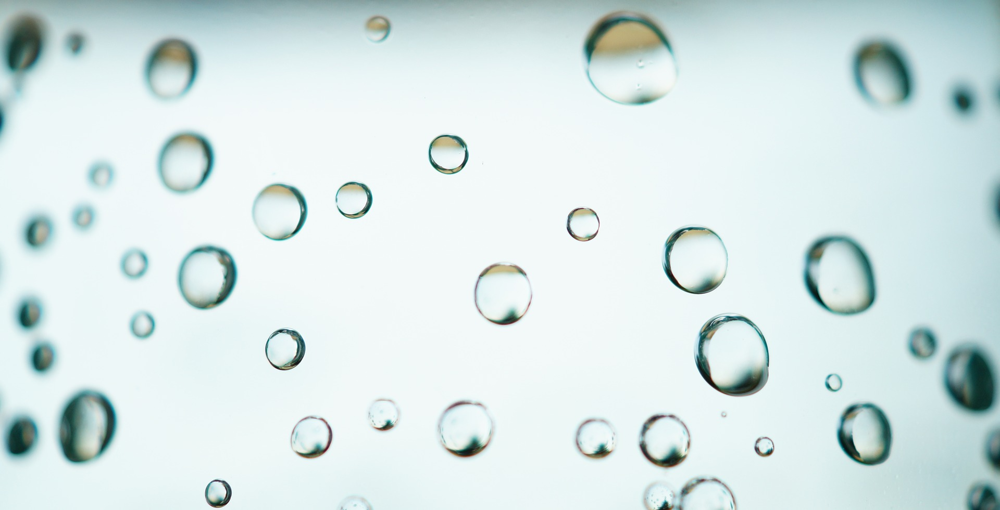
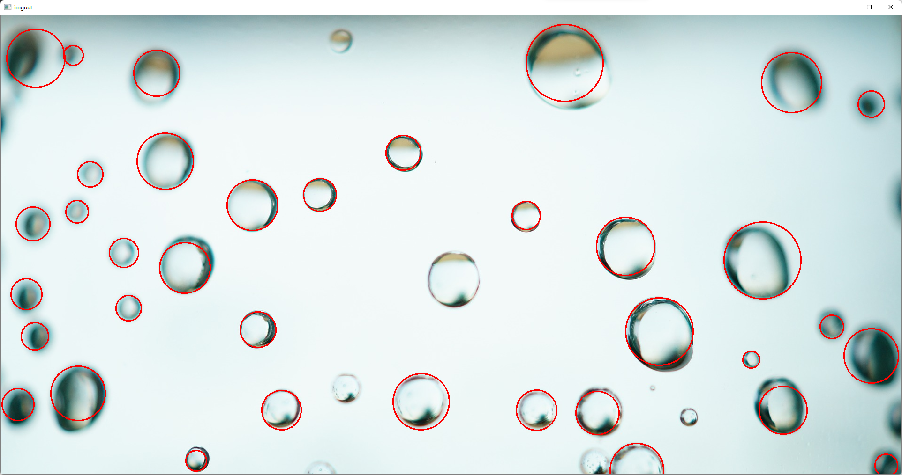

# OpenCV_Circles

## Introduction
The image for circle detection is first read to the program, then changed to gray image. Median filter is applied to generate blurred image for image processing. Houghcircles function of opencv is used to detect circles in the bubble image. 

If the detection result is not empty, the circles are drawn based on the original color image, the mark color sets to red for better contrast with the image. Details of function called in the program is attached on the end of code. 
## Comparison
 
#### bubble image for circle detection
 
#### bubble image with red circles marked by package of opencv library
 

### Comment
Bubble in the middle of image is a tough object to be detected on filtered image. Change the parameters of function can successfully detect it but lose a lot of other already detected circles. The smallest bubble should size less than 10 pixels, and it can not be detected. Lower the minimum radius parameter might help detect the bubble, but it will create a lot more false-circles. 